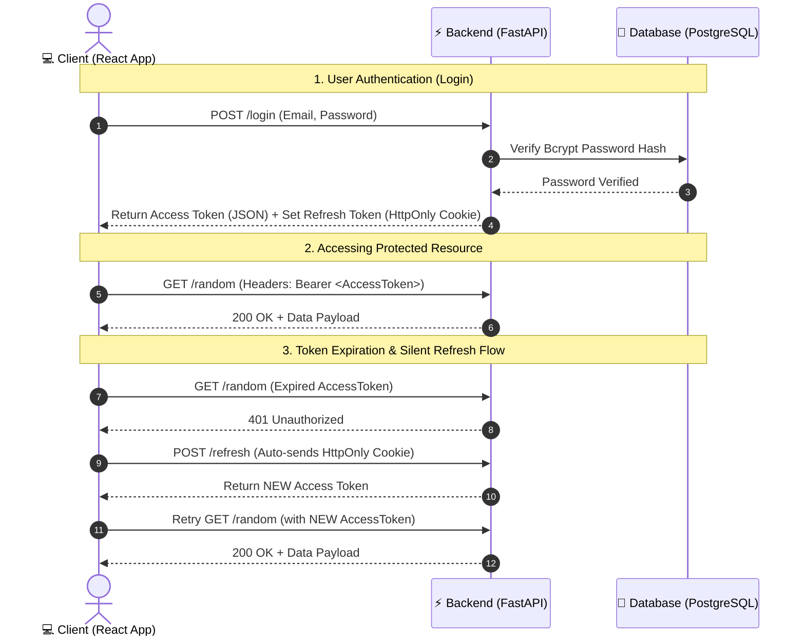

# 🔐 Industrial-Grade Authentication & Authorization Service (`auth-service`)

A high-performance, full-stack microservice demonstrating production-ready authentication and authorization patterns. Built with **Python (FastAPI)**, **PostgreSQL**, and **React (Vite)**, utilizing a dual-token architecture (**Short-lived JWT Access Tokens** + **Long-lived HttpOnly Cookie Refresh Tokens**).

---

### ⚡ Executive Summary
* **What it is**: An enterprise-grade authentication service supporting registration, login, and secure session management.
* **Why it matters**: Solves major web security threats (XSS & CSRF) using a **Dual-Token Architecture** (Short-lived JWT Access Tokens + Secure HttpOnly Refresh Cookie).
* **Tech Stack**: Python (FastAPI), React 18, PostgreSQL, PyJWT, Passlib (Bcrypt).

---

## 🌟 Architecture & Security Highlights

* **Stateless Access Tokens (JWT)**: Short-lived access tokens (15-min expiry) passed via standard `Authorization: Bearer` headers to protect API endpoints without database overhead.
* **XSS-Resistant Refresh Tokens**: Long-lived refresh tokens (7-day expiry) stored in **`HttpOnly`**, **`SameSite=Lax`** cookies—completely inaccessible to client-side JavaScript.
* **Silent Token Rotation**: Automatic client-side `401 Unauthorized` interception in React to silently refresh access tokens without forcing the user to log in again.
* **Bcrypt Password Security**: Zero plain-text password storage, using `passlib` bcrypt salted password hashing.
* **Cross-Site Request Forgery (CSRF) & XSS Defenses**: Dual-token isolation ensures API routes stay immune to CSRF while preventing token theft via XSS.

---

## 🏗️ System Architecture & Data Flow



---

## 🧰 Tech Stack

### Backend
* **Language & Framework**: Python 3.10+, FastAPI
* **Server**: Uvicorn
* **Database**: PostgreSQL (Driver: `psycopg2`)
* **Security & Auth**: PyJWT, Passlib (Bcrypt)

### Frontend
* **UI Framework**: React 18
* **Build System**: Vite
* **HTTP Client**: Axios (with Credentials support)

---

## 📡 API Reference

### 1. Public Endpoints

| Method | Endpoint | Description | Payload / Parameters |
| :--- | :--- | :--- | :--- |
| `POST` | `/users/create` | Register a new user account | `{ "name": "...", "email": "...", "password": "..." }` |
| `POST` | `/login` | Authenticate user & issue token pair | `{ "email": "...", "password": "..." }` |

### 2. Authentication & Protected Endpoints

| Method | Endpoint | Auth Required | Description |
| :--- | :--- | :--- | :--- |
| `POST` | `/refresh` | `HttpOnly` Cookie | Validates refresh token cookie & returns new Access Token |
| `GET` | `/random` | `Bearer <AccessToken>` | Example protected route returning user-specific data |
| `GET` | `/users` | None | Returns registered users (admin inspection) |

---

## ⚙️ Local Setup & Installation

### Prerequisites
* Python 3.10+
* Node.js v18+
* PostgreSQL server running locally

### 1. Backend Setup (FastAPI)

```bash
# Navigate to server directory
cd server

# Create and activate virtual environment
python3 -m venv venv
source venv/bin/activate

# Install dependencies
pip install fastapi uvicorn passlib bcrypt pyjwt psycopg2-binary python-dotenv

# Configure environment variables (.env)
# Create a .env file with:
PORT=5000
PGUSER=postgres
PGPASSWORD=your_password
PGHOST=localhost
PGPORT=5432
PGDATABASE=postgres
JWT_SECRET=your_super_secret_access_key
JWT_REFRESH_SECRET=your_super_secret_refresh_key

# Run FastAPI server
uvicorn main:app --reload --port 5000
```

### 2. Frontend Setup (React / Vite)

```bash
# Navigate to client directory
cd client

# Install dependencies
npm install

# Start Vite development server
npm start
```

Open `http://localhost:3000` in your browser to interact with the application dashboard!